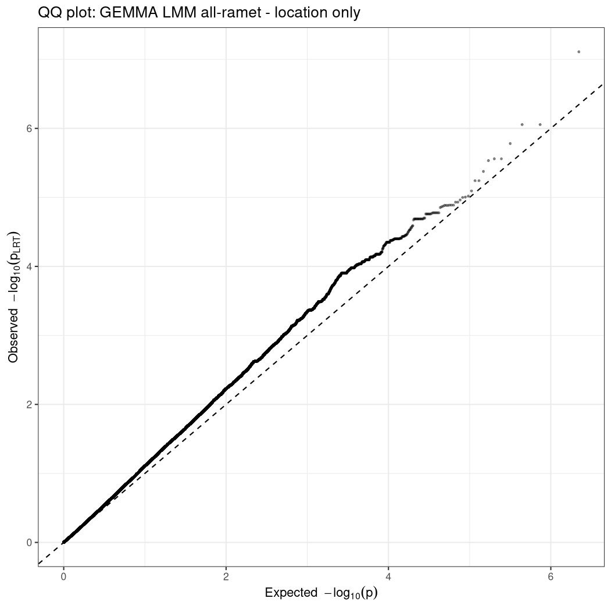
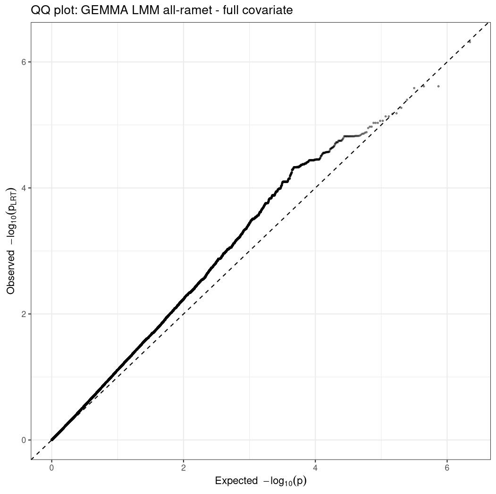
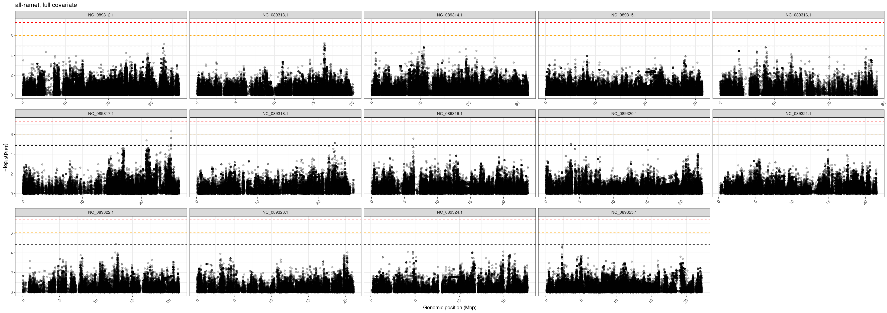

Run GWAS analyses with GEMMA
================
**AUTHOR:** Jason A. Toy  
**DATE:** 2026-07-01 <br><br>


## Start with all-ramet dataset (366 ramets)
### Location-only covariate model
Start with a model that only has the one 'location' covariate.

<br>

`run_gemma_allramet_location.slurm`:
```bash
#!/bin/bash

#SBATCH --job-name=run_gemma_allramet_location_2026-07-01
#SBATCH --output=%A_%a_%x.out
#SBATCH --error=%A_%a_%x.err
#SBATCH --mail-type=ALL
#SBATCH --mail-user=jtoy@odu.edu
#SBATCH --partition=main
#SBATCH --ntasks=1
#SBATCH --mem=100G
#SBATCH --time=5-00:00:00
#SBATCH --cpus-per-task=1

set -euo pipefail


# Load GEMMA module
module load container_env gemma/0.98.5

# Define paths
BASEDIR=/archive/barshis/barshislab/jtoy/pver_gwas/gemma_gwas

# Output directories
OUTPREFIX='allramet_location'
OUTBASE=${BASEDIR}/gemma_results/lmm/${OUTPREFIX}
mkdir -p "${OUTBASE}"


# Dense, non-LD-pruned, MAF>0.05 PLINK prefixes for association testing
BFILE=${BASEDIR}/genotypes/pver_all_QDPSB_MISSMAF05filtered_genotypes_allramet

# Kinship matrices generated from subsetted, LD-pruned, MAF>0.05 PLINK files
KIN=${BASEDIR}/kinship_matrix/output/pacu_allramet_gk1_kinship.cXX.txt

# Covariate files: no header, same sample order as .fam, first column = intercept
COV=${BASEDIR}/covariates/pacu_allramet_location.cov

# Match this to upstream max missingness/MAF thresholds.
# GEMMA has its own SNP filters, so setting this prevents GEMMA's default missingness behavior from silently imposing a stricter filter than intended.
MISS_GUARD=0.2
MAF_GUARD=0.05

# Move to working directory
cd "${OUTBASE}"

# Run GEMMA LMM
# -----------------------------
crun.gemma gemma \
  -bfile "${BFILE}" \
  -n 1 \
  -k "${KIN}" \
  -c "${COV}" \
  -maf "${MAF_GUARD}" \
  -miss "${MISS_GUARD}" \
  -lmm 4 \
  -outdir "${OUTBASE}" \
  -o "${OUTPREFIX}_lmm"

echo "Finished ${OUTPREFIX} GEMMA run"
```

<br>

Run output:
```
GEMMA 0.98.5 (2021-08-25) by Xiang Zhou, Pjotr Prins and team (C) 2012-2021
Reading Files ...
## number of total individuals = 366
## number of analyzed individuals = 366
## number of covariates = 10
## number of phenotypes = 1
## number of total SNPs/var        =  1107868
## number of analyzed SNPs         =  1107867
Start Eigen-Decomposition...
pve estimate =0.368084
se(pve) =0.0713352
```

<br>

### Full covariate model
Now run the full covariate model that includes location, depth, and prop_D.

<br>

`run_gemma_allramet_full.slurm`:
```bash
#!/bin/bash

#SBATCH --job-name=run_gemma_allramet_full_2026-07-02
#SBATCH --output=%A_%a_%x.out
#SBATCH --error=%A_%a_%x.err
#SBATCH --mail-type=ALL
#SBATCH --mail-user=jtoy@odu.edu
#SBATCH --partition=main
#SBATCH --ntasks=1
#SBATCH --mem=100G
#SBATCH --time=5-00:00:00
#SBATCH --cpus-per-task=1

set -euo pipefail


# Load GEMMA module
module load container_env gemma/0.98.5

# Define paths
BASEDIR=/archive/barshis/barshislab/jtoy/pver_gwas/gemma_gwas

# Output directories
OUTPREFIX='allramet_full'
OUTBASE=${BASEDIR}/gemma_results/lmm/${OUTPREFIX}
mkdir -p "${OUTBASE}"


# Dense, non-LD-pruned, MAF>0.05 PLINK prefixes for association testing
BFILE=${BASEDIR}/genotypes/pver_all_QDPSB_MISSMAF05filtered_genotypes_allramet

# Kinship matrices generated from subsetted, LD-pruned, MAF>0.05 PLINK files
KIN=${BASEDIR}/kinship_matrix/output/pacu_allramet_gk1_kinship.cXX.txt

# Covariate files: no header, same sample order as .fam, first column = intercept
COV=${BASEDIR}/covariates/pacu_allramet_full.cov

# Match this to upstream max missingness/MAF thresholds.
# GEMMA has its own SNP filters, so setting this prevents GEMMA's default missingness behavior from silently imposing a stricter filter than intended.
MISS_GUARD=0.2
MAF_GUARD=0.05

# Move to working directory
cd "${OUTBASE}"

# Run GEMMA LMM
# -----------------------------
crun.gemma gemma \
  -bfile "${BFILE}" \
  -n 1 \
  -k "${KIN}" \
  -c "${COV}" \
  -maf "${MAF_GUARD}" \
  -miss "${MISS_GUARD}" \
  -lmm 4 \
  -outdir "${OUTBASE}" \
  -o "${OUTPREFIX}_lmm"

echo "Finished ${OUTPREFIX} GEMMA run"
```

<br>

Run output:
```
GEMMA 0.98.5 (2021-08-25) by Xiang Zhou, Pjotr Prins and team (C) 2012-2021
Reading Files ...
## number of total individuals = 366
## number of analyzed individuals = 366
## number of covariates = 12
## number of phenotypes = 1
## number of total SNPs/var        =  1107868
## number of analyzed SNPs         =  1107867
Start Eigen-Decomposition...
pve estimate =0.329027
se(pve) =0.0702668
```

<br>

### Summarize and explore the results from the two all-ramet model runs
`summarize_explore_gemma_results.R`:
```r
# Summarize and explore GEMMA results
# Created: 2026-07-02
# Last updated: 2026-07-02
# Jason A. Toy

rm(list = ls())

setwd("/archive/barshis/barshislab/jtoy/pver_gwas/gemma_gwas/")

library(tidyverse)
```

<br>

Start with the <u>all-ramet, location-only</u> GEMMA run:
```r
##### all-ramet location-only model #####

# Load in assoc file
allramet_location <- read_tsv("gemma_results/lmm/allramet_location/allramet_location_lmm.assoc.txt")


# adjust p-values using Benjamini & Hochberg (FDR) correction and calculate negative-log transformations for plotting
allramet_location_fdr <- allramet_location %>% 
  mutate(
    q_wald = p.adjust(p_wald, method = "BH"),
    q_lrt = p.adjust(p_lrt, method = "BH"),
    q_score = p.adjust(p_score, method = "BH"),
    neglog10_p_lrt = -log10(p_lrt),
    neglog10_q_lrt = -log10(q_lrt)
  )


# calculate other thresholds
n_tests <- nrow(allramet_location_fdr)

# Bonferroni correction
bonferroni_p <- 0.05 / n_tests

# 1/M commonly used threshold (M = number of markers/tests)
suggestive_p <- 1 / n_tests

# LD-aware Bonferonni correction using approximate number of effective/independent tests (M eff)
num_LDpruned_snps <- 74962 
ld_aware_p <- 0.05 / num_LDpruned_snps

# LD-aware 1/M threshold
ld_sug_p <- 1 / num_LDpruned_snps


thresholds_ARL <- tibble(
  threshold = c("Bonferroni_0.05", "Suggestive_1_over_M", "LDaware_Bon_0.05", "LDaware_1_over_M"),
  p_value = c(bonferroni_p, suggestive_p, ld_aware_p, ld_sug_p),
  neglog10_p = -log10(p_value)
)

thresholds_ARL   # ARL = "all-ramet, location" model
```
```
 threshold                p_value neglog10_p
 <chr>                      <dbl>      <dbl>
 Bonferroni_0.05     0.0000000451       7.35
 Suggestive_1_over_M 0.000000903        6.04
 LDaware_Bon_0.05    0.000000667        6.18
 LDaware_1_over_M    0.0000133          4.87
```

<br>

```r
# summarize results
allramet_location_fdr %>%
  summarise(
    n_snps = n(),
    min_p_lrt = min(p_lrt, na.rm = TRUE),
    min_q_lrt = min(q_lrt, na.rm = TRUE),
    n_q05 = sum(q_lrt < 0.05, na.rm = TRUE),
    n_q10 = sum(q_lrt < 0.10, na.rm = TRUE),
    n_bon = sum(p_lrt < bonferroni_p, na.rm = TRUE),
    n_sug = sum(p_lrt < suggestive_p, na.rm = TRUE),
    n_LDaware = sum(p_lrt < ld_aware_p, na.rm = TRUE),
    n_LDsug = sum(p_lrt < ld_sug_p, na.rm = TRUE)
  )
```
```
  n_snps    min_p_lrt min_q_lrt n_q05 n_q10 n_bon n_sug n_LDaware n_LDsug
   <int>        <dbl>     <dbl> <int> <int> <int> <int>     <int>   <int>
 1107867 0.0000000777    0.0860     0     1     0     3         1      23
```
- No SNPs reach the strict Bonferroni correction <0.05 cutoff
- One SNP falls below the 0.10 cutoff
- 3 SNPs fall below the 1/M "suggestive" cutoff
- One SNP falls below the LD-aware 0.05 Bonferroni cutoff
- 23 SNPs fall below the LD-aware 1/M suggestive cutoff

The 1/M suggestive cutoffs are useful thresholds to use if few or no SNPs pass the strict Bonferroni cutoff. They essentially establish an error rate that allows for 1 expected false positive test across the whole set of tests.

<br>

```
# look at top SNPs (23 snps that meet LD-aware suggestive threshold)
top_lrt_ARL <- allramet_location_fdr %>%
  arrange(p_lrt) %>%
  slice_head(n = 23)

print(top_lrt_ARL, n = 25)
```
```
   chr                    rs          ps n_miss allele1 allele0    af   beta     se logl_H1 l_remle l_mle      p_wald        p_lrt     p_score q_wald  q_lrt q_score neglog10_p_lrt neglog10_q_lrt
   <chr>                  <chr>    <dbl>  <dbl> <chr>   <chr>   <dbl>  <dbl>  <dbl>   <dbl>   <dbl> <dbl>       <dbl>        <dbl>       <dbl>  <dbl>  <dbl>   <dbl>          <dbl>          <dbl>
 1 NC_089317.1_Pverrucosa .     24952099      0 A       G       0.362  0.278 0.0511   -198.    1.13 0.880 0.000000106 0.0000000777 0.000000639  0.118 0.0860   0.708           7.11          1.07 
 2 NC_089317.1_Pverrucosa .     24950999      0 C       T       0.429  0.242 0.0490   -200.    1.17 0.915 0.00000123  0.000000880  0.00000469   0.453 0.325    0.726           6.06          0.488
 3 NC_089317.1_Pverrucosa .     24953140      0 A       T       0.429  0.242 0.0490   -200.    1.17 0.915 0.00000123  0.000000880  0.00000469   0.453 0.325    0.726           6.06          0.488
 4 NC_089317.1_Pverrucosa .     20821793      0 G       T       0.187 -0.332 0.0698   -201.    1.37 1.14  0.00000278  0.00000166   0.00000486   0.466 0.331    0.726           5.78          0.480
 5 NC_089320.1_Pverrucosa .      4318719      0 T       C       0.128 -0.295 0.0634   -201.    1.40 1.15  0.00000468  0.00000276   0.00000736   0.466 0.331    0.726           5.56          0.480
 6 NC_089320.1_Pverrucosa .      4318740      0 T       C       0.128 -0.295 0.0634   -201.    1.40 1.15  0.00000468  0.00000276   0.00000736   0.466 0.331    0.726           5.56          0.480
 7 NC_089318.1_Pverrucosa .     21725277      0 A       G       0.269 -0.261 0.0561   -201.    1.29 1.05  0.00000462  0.00000293   0.00000973   0.466 0.331    0.726           5.53          0.480
 8 NC_089317.1_Pverrucosa .     24951439      0 T       C       0.418  0.229 0.0500   -202.    1.23 0.967 0.00000622  0.00000421   0.0000159    0.466 0.331    0.726           5.38          0.480
 9 NC_089318.1_Pverrucosa .     22675300      0 A       G       0.281  0.226 0.0500   -202.    1.27 1.01  0.00000869  0.00000573   0.0000189    0.466 0.331    0.726           5.24          0.480
10 NC_089318.1_Pverrucosa .     22676016      0 C       T       0.281  0.226 0.0500   -202.    1.27 1.01  0.00000869  0.00000573   0.0000189    0.466 0.331    0.726           5.24          0.480
11 NC_089313.1_Pverrucosa .     16322950      0 T       C       0.078 -0.341 0.0772   -202.    1.34 1.06  0.0000130   0.00000806   0.0000222    0.466 0.331    0.726           5.09          0.480
12 NC_089312.1_Pverrucosa .      5435547      0 T       A       0.068  0.428 0.0978   -203.    1.35 1.05  0.0000157   0.00000957   0.0000256    0.466 0.331    0.726           5.02          0.480
13 NC_089313.1_Pverrucosa .     16431423      0 G       A       0.138 -0.303 0.0692   -203.    1.37 1.12  0.0000160   0.00000991   0.0000244    0.466 0.331    0.726           5.00          0.480
14 NC_089318.1_Pverrucosa .     22388172      0 A       G       0.328 -0.218 0.0499   -203.    1.37 1.12  0.0000160   0.0000100    0.0000248    0.466 0.331    0.726           5.00          0.480
15 NC_089313.1_Pverrucosa .     16430922      0 A       G       0.086 -0.361 0.0828   -203.    1.35 1.09  0.0000174   0.0000109    0.0000283    0.466 0.331    0.726           4.96          0.480
16 NC_089320.1_Pverrucosa .      3762279      0 T       C       0.482 -0.215 0.0492   -203.    1.21 0.956 0.0000160   0.0000117    0.0000435    0.466 0.331    0.726           4.93          0.480
17 NC_089320.1_Pverrucosa .      3762337      0 A       G       0.482 -0.215 0.0492   -203.    1.21 0.956 0.0000160   0.0000117    0.0000435    0.466 0.331    0.726           4.93          0.480
18 NC_089313.1_Pverrucosa .     16454151      0 C       T       0.104 -0.378 0.0865   -203.    1.17 0.897 0.0000169   0.0000129    0.0000529    0.466 0.331    0.726           4.89          0.480
19 NC_089313.1_Pverrucosa .     16454204      0 G       C       0.104 -0.378 0.0865   -203.    1.17 0.897 0.0000169   0.0000129    0.0000529    0.466 0.331    0.726           4.89          0.480
20 NC_089313.1_Pverrucosa .     16454567      0 G       A       0.104 -0.378 0.0865   -203.    1.17 0.897 0.0000169   0.0000129    0.0000529    0.466 0.331    0.726           4.89          0.480
21 NC_089316.1_Pverrucosa .      8354664      0 C       T       0.149  0.228 0.0526   -203.    1.21 0.920 0.0000184   0.0000130    0.0000481    0.466 0.331    0.726           4.88          0.480
22 NC_089316.1_Pverrucosa .      8354849      0 T       C       0.149  0.228 0.0526   -203.    1.21 0.920 0.0000184   0.0000130    0.0000481    0.466 0.331    0.726           4.88          0.480
23 NC_089316.1_Pverrucosa .      8355085      0 C       A       0.149  0.228 0.0526   -203.    1.21 0.920 0.0000184   0.0000130    0.0000481    0.466 0.331    0.726           4.88          0.480
```

<br>

```r
# list chromosomes with SNPs that meet LD-aware suggestive threshold
top_lrt_ARL %>% 
  mutate(chr = str_remove(chr, "_Pverrucosa") %>% as.factor()) %>% 
  droplevels() %>% 
  pull(chr) %>% 
  levels()

# and count SNPs on each chromosome
top_lrt_ARL %>% 
  mutate(chr = str_remove(chr, "_Pverrucosa") %>% as.factor()) %>% 
  count(chr, sort = TRUE)
```
 ```
 "NC_089312.1" "NC_089313.1" "NC_089316.1" "NC_089317.1" "NC_089318.1" "NC_089320.1"


 chr             n
 <fct>       <int>
 NC_089313.1     6
 NC_089317.1     5
 NC_089318.1     4
 NC_089320.1     4
 NC_089316.1     3
 NC_089312.1     1
```

<br>

Check distribution of p-values with QQ plot:
```r
# QQ plot of p-values
qq_df_ARL <- allramet_location_fdr %>%
  arrange(p_lrt) %>%
  mutate(
    observed = -log10(p_lrt),
    expected = -log10(ppoints(n()))
  )

ggplot(qq_df_ARL, aes(x = expected, y = observed)) +
  geom_point(alpha = 0.4, size = 0.5) +
  geom_abline(slope = 1, intercept = 0, linetype = "dashed") +
  labs(
    x = expression(Expected~~-log[10](p)),
    y = expression(Observed~~-log[10](p[LRT])),
    title = "QQ plot: GEMMA LMM all-ramet + location"
  ) +
  theme_bw()
```

<br>

Now look at the overall pattern of p-values across the genome (Manhattan plot):
```r
# Manhattan plot
ggplot(allramet_location_fdr %>% 
         mutate(chr = str_remove(chr, "_Pverrucosa")) %>% 
         filter(str_detect(chr, "NC")),
       aes(x = ps/1e6, y = neglog10_p_lrt)) +
  geom_point(alpha = 0.25) +
  geom_hline(yintercept = 7.35, color = "red", linetype = "dashed", linewidth = 0.5) +
  geom_hline(yintercept = 6.04, color = "orange", linetype = "dashed", linewidth = 0.5) +
  geom_hline(yintercept = 4.87, color = "black", linetype = "dashed", linewidth = 0.5) +
  facet_wrap(~ chr, scales = "free_x", nrow = 3) +
  labs(
    x = "Genomic position (Mbp)",
    y = expression(-log[10](p[LRT])),
    title = "all-ramet, location only"
  ) +
  theme_bw() +
  theme(axis.text.x = element_text(angle = 45, hjust = 1))
  ```


<br>
<br>

Now repeat for the <u>all-ramet, full-covariate</u> GEMMA run:
```r
##### all-ramet full covariate model #####

# First compare full covariate model fit to location only model fit using ML log-likelihoods
ll_allramet_location <- -212.401
ll_allramet_full <- -199.845

lrt_stat <- 2 * (ll_allramet_full - ll_allramet_location)

df <- 2     # one df per added parameter

lrt_pval <- pchisq(lrt_stat, df = df, lower.tail = FALSE)

lrt_pval
```
```
3.52369642009043e-06
```
The significant likelihood-ratio test (p = 3.52e-6) shows that adding depth and prop_D significantly improved model fit relative to the location-only model. This means that these covariates explain additional ED50 variation beyond location and genome-wide relatedness (kinship).

<br>

```r
## Now let's take a look at the results for this model

# Load in files
allramet_full <- read_tsv("gemma_results/lmm/allramet_full/allramet_full_lmm.assoc.txt")


# adjust p-values using Benjamini & Hochberg (FDR) correction and calculate negative-log transformations for plotting
allramet_full_fdr <- allramet_full %>% 
  mutate(
    q_wald = p.adjust(p_wald, method = "BH"),
    q_lrt = p.adjust(p_lrt, method = "BH"),
    q_score = p.adjust(p_score, method = "BH"),
    neglog10_p_lrt = -log10(p_lrt),
    neglog10_q_lrt = -log10(q_lrt)
  )


# calculate other thresholds (same as for location-only model, since number of SNPs tested is the same)
n_tests <- nrow(allramet_full_fdr)

# Bonferroni correction
bonferroni_p <- 0.05 / n_tests

# 1/M commonly used threshold (M = number of markers/tests)
suggestive_p <- 1 / n_tests

# LD-aware Bonferonni correction using approximate number of effective/independent tests (M eff)
num_LDpruned_snps <- 74962 
ld_aware_p <- 0.05 / num_LDpruned_snps

# LD-aware 1/M threshold
ld_sug_p <- 1 / num_LDpruned_snps


thresholds <- tibble(
  threshold = c("Bonferroni_0.05", "Suggestive_1_over_M", "LDaware_Bon_0.05", "LDaware_1_over_M"),
  p_value = c(bonferroni_p, suggestive_p, ld_aware_p, ld_sug_p),
  neglog10_p = -log10(p_value)
)

thresholds


# summarize results
allramet_full_fdr %>%
  summarise(
    n_snps = n(),
    min_p_lrt = min(p_lrt, na.rm = TRUE),
    min_q_lrt = min(q_lrt, na.rm = TRUE),
    n_q05 = sum(q_lrt < 0.05, na.rm = TRUE),
    n_q10 = sum(q_lrt < 0.10, na.rm = TRUE),
    n_bon = sum(p_lrt < bonferroni_p, na.rm = TRUE),
    n_sug = sum(p_lrt < suggestive_p, na.rm = TRUE),
    n_LDaware = sum(p_lrt < ld_aware_p, na.rm = TRUE),
    n_LDsug = sum(p_lrt < ld_sug_p, na.rm = TRUE)
  )
```
```
  n_snps   min_p_lrt min_q_lrt n_q05 n_q10 n_bon n_sug n_LDaware n_LDsug
   <int>       <dbl>     <dbl> <int> <int> <int> <int>     <int>   <int>
 1107867 0.000000483     0.221     0     0     0     1         1      20
```
So now:
- No SNPs reach the strict Bonferroni correction <0.05 cutoff
- No SNPs fall below the 0.10 cutoff either
- One SNPs fall below the 1/M "suggestive" cutoff
- One SNP falls below the LD-aware 0.05 Bonferroni cutoff
- 20 SNPs fall below the LD-aware 1/M suggestive cutoff

<br>

```r
# look at top SNPs
top_lrt_ARF <- allramet_full_fdr %>%
  arrange(p_lrt) %>%
  slice_head(n = 20)

print(top_lrt_ARF, n = 20)
```
```
   chr                    rs          ps n_miss allele1 allele0    af   beta     se logl_H1 l_remle l_mle      p_wald       p_lrt    p_score q_wald q_lrt q_score neglog10_p_lrt neglog10_q_lrt
   <chr>                  <chr>    <dbl>  <dbl> <chr>   <chr>   <dbl>  <dbl>  <dbl>   <dbl>   <dbl> <dbl>       <dbl>       <dbl>      <dbl>  <dbl> <dbl>   <dbl>          <dbl>          <dbl>
 1 NC_089317.1_Pverrucosa .     24952099      0 A       G       0.362  0.249 0.0497   -187.   1.05  0.819 0.000000856 0.000000483 0.00000215  0.349 0.221   0.613           6.32          0.655
 2 NC_089317.1_Pverrucosa .     24950999      0 C       T       0.429  0.221 0.0472   -189.   1.06  0.825 0.00000414  0.00000244  0.00000881  0.349 0.221   0.613           5.61          0.655
 3 NC_089317.1_Pverrucosa .     24953140      0 A       T       0.429  0.221 0.0472   -189.   1.06  0.825 0.00000414  0.00000244  0.00000881  0.349 0.221   0.613           5.61          0.655
 4 NC_089319.1_Pverrucosa .      6346266      0 T       C       0.47   0.219 0.0467   -189.   0.980 0.740 0.00000398  0.00000261  0.0000120   0.349 0.221   0.613           5.58          0.655
 5 NC_089317.1_Pverrucosa .     20821793      0 G       T       0.187 -0.304 0.0667   -189.   1.21  0.990 0.00000716  0.00000398  0.00000941  0.349 0.221   0.613           5.40          0.655
 6 NC_089313.1_Pverrucosa .     16431423      0 G       A       0.138 -0.293 0.0651   -189.   1.13  0.904 0.00000943  0.00000537  0.0000145   0.349 0.221   0.613           5.27          0.655
 7 NC_089313.1_Pverrucosa .     16430922      0 A       G       0.086 -0.347 0.0779   -190.   1.13  0.899 0.0000114   0.00000654  0.0000176   0.349 0.221   0.613           5.18          0.655
 8 NC_089312.1_Pverrucosa .     32935218      0 C       T       0.134  0.292 0.0646   -190.   0.891 0.627 0.00000831  0.00000667  0.0000399   0.349 0.221   0.613           5.18          0.655
 9 NC_089318.1_Pverrucosa .     22675300      0 A       G       0.281  0.211 0.0476   -190.   1.09  0.856 0.0000124   0.00000732  0.0000215   0.349 0.221   0.613           5.14          0.655
10 NC_089318.1_Pverrucosa .     22676016      0 C       T       0.281  0.211 0.0476   -190.   1.09  0.856 0.0000124   0.00000732  0.0000215   0.349 0.221   0.613           5.14          0.655
11 NC_089320.1_Pverrucosa .      3762279      0 T       C       0.482 -0.205 0.0465   -190.   1.05  0.830 0.0000137   0.00000861  0.0000280   0.349 0.221   0.613           5.06          0.655
12 NC_089320.1_Pverrucosa .      3762337      0 A       G       0.482 -0.205 0.0465   -190.   1.05  0.830 0.0000137   0.00000861  0.0000280   0.349 0.221   0.613           5.06          0.655
13 NC_089313.1_Pverrucosa .     16454151      0 C       T       0.104 -0.361 0.0820   -190.   1.01  0.774 0.0000142   0.00000928  0.0000339   0.349 0.221   0.613           5.03          0.655
14 NC_089313.1_Pverrucosa .     16454204      0 G       C       0.104 -0.361 0.0820   -190.   1.01  0.774 0.0000142   0.00000928  0.0000339   0.349 0.221   0.613           5.03          0.655
15 NC_089313.1_Pverrucosa .     16454567      0 G       A       0.104 -0.361 0.0820   -190.   1.01  0.774 0.0000142   0.00000928  0.0000339   0.349 0.221   0.613           5.03          0.655
16 NC_089317.1_Pverrucosa .     24929637      0 C       T       0.414  0.229 0.0528   -190.   1.23  0.991 0.0000189   0.0000107   0.0000224   0.349 0.221   0.613           4.97          0.655
17 NC_089317.1_Pverrucosa .     24929771      0 T       G       0.414  0.229 0.0528   -190.   1.23  0.991 0.0000189   0.0000107   0.0000224   0.349 0.221   0.613           4.97          0.655
18 NC_089313.1_Pverrucosa .     16422646      0 T       C       0.171  0.299 0.0670   -190.   1.76  1.47  0.0000106   0.0000112   0.0000216   0.349 0.221   0.613           4.95          0.655
19 NC_089322.1_Pverrucosa .     12717198      0 A       G       0.317  0.249 0.0580   -190.   1.21  0.980 0.0000228   0.0000130   0.0000278   0.349 0.221   0.613           4.88          0.655
20 NC_089317.1_Pverrucosa .     24951439      0 T       C       0.418  0.207 0.0482   -190.   1.11  0.868 0.0000226   0.0000133   0.0000353   0.349 0.221   0.613           4.88          0.655
```

<br>

```r
# list chromosomes with SNPs that meet LD-aware suggestive threshold
top_lrt_ARF %>% 
  mutate(chr = str_remove(chr, "_Pverrucosa") %>% as.factor()) %>% 
  droplevels() %>% 
  pull(chr) %>% 
  levels()

# and count SNPs on each chromosome
top_lrt_ARF %>% 
  mutate(chr = str_remove(chr, "_Pverrucosa") %>% as.factor()) %>% 
  count(chr, sort = TRUE)
```
```
"NC_089312.1" "NC_089313.1" "NC_089317.1" "NC_089318.1" "NC_089319.1" "NC_089320.1" "NC_089322.1"


 chr             n
 <fct>       <int>
 NC_089317.1     7
 NC_089313.1     6
 NC_089318.1     2
 NC_089320.1     2
 NC_089312.1     1
 NC_089319.1     1
 NC_089322.1     1
```
So the respresented chromosomes in the candidate list actually changed a bit in the <u>full-covariate</u> model. Chromosomes NC_089319 and NC_089322 now appear in the list, while NC_089316 is no longer present. This likely resulted from the additional factors in the models elevating some regional peaks and lowering others that were at least partially driven by these new factors.

For reference, this was the breakdown of the top 50 SNPs from the <u>location-only</u> run:
```
chr             n
<fct>       <int>
NC_089313.1     6
NC_089317.1     5
NC_089318.1     4
NC_089320.1     4
NC_089316.1     3
NC_089312.1     1
```

<br>

```r
# QQ plot of p-values
qq_df_ARF <- allramet_full_fdr %>%
  arrange(p_lrt) %>%
  mutate(
    observed = -log10(p_lrt),
    expected = -log10(ppoints(n()))
  )

ggplot(qq_df_ARF, aes(x = expected, y = observed)) +
  geom_point(alpha = 0.4, size = 0.5) +
  geom_abline(slope = 1, intercept = 0, linetype = "dashed") +
  labs(
    x = expression(Expected~~-log[10](p)),
    y = expression(Observed~~-log[10](p[LRT])),
    title = "QQ plot: GEMMA LMM all-ramet - full covariate"
  ) +
  theme_bw()
```


Adding depth and symbiont composition reduced the most extreme tail of the GWAS p-value distribution, suggesting that some location-only associations were partly aligned with these covariates. However, the full-covariate QQ plot still shows a broad excess of small p-values in the expected -log range of about 2 to 4.5, indicating that additional host-genomic, clonal, or residual (unmodeled) structure remains.

<br>

```r
# Manhattan plot
ggplot(allramet_full_fdr %>% 
         mutate(chr = str_remove(chr, "_Pverrucosa")) %>% 
         filter(str_detect(chr, "NC")),
       aes(x = ps/1e6, y = neglog10_p_lrt)) +
  geom_point(alpha = 0.25) +
  geom_hline(yintercept = 7.35, color = "red", linetype = "dashed", linewidth = 0.5) +
  geom_hline(yintercept = 6.04, color = "orange", linetype = "dashed", linewidth = 0.5) +
  geom_hline(yintercept = 4.87, color = "black", linetype = "dashed", linewidth = 0.5) +
  facet_wrap(~ chr, scales = "free_x", nrow = 3) +
  labs(
    x = "Genomic position (Mbp)",
    y = expression(-log[10](p[LRT])),
    title = "all-ramet, full covariate"
  ) +
  theme_bw() +
  theme(axis.text.x = element_text(angle = 45, hjust = 1))
```


<br>

Let's reorder the list of candidate SNPs by position so we can identify these peaks more clearly:
```r
print(top_lrt_ARF %>% 
        mutate(chr = str_remove(chr, "_Pverrucosa")) %>% 
        arrange(chr, ps) %>% 
        select(c(chr, ps, allele1, allele0, af, beta, se, logl_H1, l_remle, l_mle, p_lrt, q_lrt, neglog10_p_lrt)) %>% 
        group_by(chr) %>%
        mutate(dist_from_prev_bp = ps - lag(ps)) %>%
        ungroup(),
      n = 20)
```
```
   chr               ps allele1 allele0    af   beta     se logl_H1 l_remle l_mle       p_lrt q_lrt neglog10_p_lrt dist_from_prev_bp
   <chr>          <dbl> <chr>   <chr>   <dbl>  <dbl>  <dbl>   <dbl>   <dbl> <dbl>       <dbl> <dbl>          <dbl>             <dbl>
 1 NC_089312.1 32935218 C       T       0.134  0.292 0.0646   -190.   0.891 0.627 0.00000667  0.221           5.18                NA
 2 NC_089313.1 16422646 T       C       0.171  0.299 0.0670   -190.   1.76  1.47  0.0000112   0.221           4.95                NA
 3 NC_089313.1 16430922 A       G       0.086 -0.347 0.0779   -190.   1.13  0.899 0.00000654  0.221           5.18              8276
 4 NC_089313.1 16431423 G       A       0.138 -0.293 0.0651   -189.   1.13  0.904 0.00000537  0.221           5.27               501
 5 NC_089313.1 16454151 C       T       0.104 -0.361 0.0820   -190.   1.01  0.774 0.00000928  0.221           5.03             22728
 6 NC_089313.1 16454204 G       C       0.104 -0.361 0.0820   -190.   1.01  0.774 0.00000928  0.221           5.03                53
 7 NC_089313.1 16454567 G       A       0.104 -0.361 0.0820   -190.   1.01  0.774 0.00000928  0.221           5.03               363
 8 NC_089317.1 20821793 G       T       0.187 -0.304 0.0667   -189.   1.21  0.990 0.00000398  0.221           5.40                NA
 9 NC_089317.1 24929637 C       T       0.414  0.229 0.0528   -190.   1.23  0.991 0.0000107   0.221           4.97           4107844
10 NC_089317.1 24929771 T       G       0.414  0.229 0.0528   -190.   1.23  0.991 0.0000107   0.221           4.97               134
11 NC_089317.1 24950999 C       T       0.429  0.221 0.0472   -189.   1.06  0.825 0.00000244  0.221           5.61             21228
12 NC_089317.1 24951439 T       C       0.418  0.207 0.0482   -190.   1.11  0.868 0.0000133   0.221           4.88               440
13 NC_089317.1 24952099 A       G       0.362  0.249 0.0497   -187.   1.05  0.819 0.000000483 0.221           6.32               660
14 NC_089317.1 24953140 A       T       0.429  0.221 0.0472   -189.   1.06  0.825 0.00000244  0.221           5.61              1041
15 NC_089318.1 22675300 A       G       0.281  0.211 0.0476   -190.   1.09  0.856 0.00000732  0.221           5.14                NA
16 NC_089318.1 22676016 C       T       0.281  0.211 0.0476   -190.   1.09  0.856 0.00000732  0.221           5.14               716
17 NC_089319.1  6346266 T       C       0.47   0.219 0.0467   -189.   0.980 0.740 0.00000261  0.221           5.58                NA
18 NC_089320.1  3762279 T       C       0.482 -0.205 0.0465   -190.   1.05  0.830 0.00000861  0.221           5.06                NA
19 NC_089320.1  3762337 A       G       0.482 -0.205 0.0465   -190.   1.05  0.830 0.00000861  0.221           5.06                58
20 NC_089322.1 12717198 A       G       0.317  0.249 0.0580   -190.   1.21  0.980 0.0000130   0.221           4.88                NA
```

<br>

### Investigate candidate regions from all-ramet full model
```
   chr               ps
   <chr>          <dbl>
 1 NC_089312.1 32935218   relaxin receptor 2-like
 2 NC_089313.1 16422646   rasGAP-activating-like protein 1
 3 NC_089313.1 16430922   
 4 NC_089313.1 16431423   mitotic-spindle organizing protein 2B-like
 5 NC_089313.1 16454151   oxysterol-binding protein 1-like
 6 NC_089313.1 16454204   oxysterol-binding protein 1-like
 7 NC_089313.1 16454567   oxysterol-binding protein 1-like
 8 NC_089317.1 20821793   patched domain-containing protein 3-like
 9 NC_089317.1 24929637   beta-galactosidase-1-like protein 3
10 NC_089317.1 24929771   beta-galactosidase-1-like protein 3
11 NC_089317.1 24950999   uncharacterized LOC136281714
12 NC_089317.1 24951439   uncharacterized LOC136281714
13 NC_089317.1 24952099   uncharacterized LOC136281714, uncharacterized LOC136281715
14 NC_089317.1 24953140   uncharacterized LOC136281715
15 NC_089318.1 22675300   uncharacterized LOC136282620
16 NC_089318.1 22676016   
17 NC_089319.1  6346266   
18 NC_089320.1  3762279   uncharacterized LOC131785903
19 NC_089320.1  3762337   uncharacterized LOC131785903
20 NC_089322.1 12717198   uncharacterized LOC131770041
```

<br>
<br>
<br>


## Now let's move on to the clone-pruned dataset (132 ramets)
### Location-only covariate model
Again, start with a model that only has the one 'location' covariate.

<br>

`run_gemma_cpruned_location.slurm`:
```bash
#!/bin/bash

#SBATCH --job-name=run_gemma_cpruned_location_2026-07-06
#SBATCH --output=%A_%a_%x.out
#SBATCH --error=%A_%a_%x.err
#SBATCH --mail-type=ALL
#SBATCH --mail-user=jtoy@odu.edu
#SBATCH --partition=main
#SBATCH --ntasks=1
#SBATCH --mem=100G
#SBATCH --time=5-00:00:00
#SBATCH --cpus-per-task=1

set -euo pipefail


# Load GEMMA module
module load container_env gemma/0.98.5

# Define paths
BASEDIR=/archive/barshis/barshislab/jtoy/pver_gwas/gemma_gwas

# Output directories
OUTPREFIX='cpruned_location'
OUTBASE=${BASEDIR}/gemma_results/lmm/${OUTPREFIX}
mkdir -p "${OUTBASE}"


# Dense, non-LD-pruned, MAF>0.05 PLINK prefixes for association testing
BFILE=${BASEDIR}/genotypes/pver_all_QDPSB_MISSMAF05filtered_genotypes_cpruned

# Kinship matrices generated from subsetted, LD-pruned, MAF>0.05 PLINK files
KIN=${BASEDIR}/kinship_matrix/output/pacu_cpruned_gk1_kinship.cXX.txt

# Covariate files: no header, same sample order as .fam, first column = intercept
COV=${BASEDIR}/covariates/pacu_cpruned_location.cov

# Match this to upstream max missingness/MAF thresholds.
# GEMMA has its own SNP filters, so setting this prevents GEMMA's default missingness behavior from silently imposing a stricter filter than intended.
MISS_GUARD=0.2
MAF_GUARD=0.05

# Move to working directory
cd "${OUTBASE}"

# Run GEMMA LMM
# -----------------------------
crun.gemma gemma \
  -bfile "${BFILE}" \
  -n 1 \
  -k "${KIN}" \
  -c "${COV}" \
  -maf "${MAF_GUARD}" \
  -miss "${MISS_GUARD}" \
  -lmm 4 \
  -outdir "${OUTBASE}" \
  -o "${OUTPREFIX}_lmm"

echo "Finished ${OUTPREFIX} GEMMA run"
```

<br>

Run output:
```
GEMMA 0.98.5 (2021-08-25) by Xiang Zhou, Pjotr Prins and team (C) 2012-2021
Reading Files ...
## number of total individuals = 132
## number of analyzed individuals = 132
## number of covariates = 10
## number of phenotypes = 1
## number of total SNPs/var        =  1055527
## number of analyzed SNPs         =  1055525
Start Eigen-Decomposition...
pve estimate =0.232968
se(pve) =0.373793
```

<br>

### Full covariate model
Now run the full covariate model that includes location, depth, and prop_D.

<br>

`run_gemma_cpruned_full.slurm`:
```bash
#!/bin/bash

#SBATCH --job-name=run_gemma_cpruned_full_2026-07-06
#SBATCH --output=%A_%a_%x.out
#SBATCH --error=%A_%a_%x.err
#SBATCH --mail-type=ALL
#SBATCH --mail-user=jtoy@odu.edu
#SBATCH --partition=main
#SBATCH --ntasks=1
#SBATCH --mem=100G
#SBATCH --time=5-00:00:00
#SBATCH --cpus-per-task=1

set -euo pipefail


# Load GEMMA module
module load container_env gemma/0.98.5

# Define paths
BASEDIR=/archive/barshis/barshislab/jtoy/pver_gwas/gemma_gwas

# Output directories
OUTPREFIX='cpruned_full'
OUTBASE=${BASEDIR}/gemma_results/lmm/${OUTPREFIX}
mkdir -p "${OUTBASE}"


# Dense, non-LD-pruned, MAF>0.05 PLINK prefixes for association testing
BFILE=${BASEDIR}/genotypes/pver_all_QDPSB_MISSMAF05filtered_genotypes_cpruned

# Kinship matrices generated from subsetted, LD-pruned, MAF>0.05 PLINK files
KIN=${BASEDIR}/kinship_matrix/output/pacu_cpruned_gk1_kinship.cXX.txt

# Covariate files: no header, same sample order as .fam, first column = intercept
COV=${BASEDIR}/covariates/pacu_cpruned_full.cov

# Match this to upstream max missingness/MAF thresholds.
# GEMMA has its own SNP filters, so setting this prevents GEMMA's default missingness behavior from silently imposing a stricter filter than intended.
MISS_GUARD=0.2
MAF_GUARD=0.05

# Move to working directory
cd "${OUTBASE}"

# Run GEMMA LMM
# -----------------------------
crun.gemma gemma \
  -bfile "${BFILE}" \
  -n 1 \
  -k "${KIN}" \
  -c "${COV}" \
  -maf "${MAF_GUARD}" \
  -miss "${MISS_GUARD}" \
  -lmm 4 \
  -outdir "${OUTBASE}" \
  -o "${OUTPREFIX}_lmm"

echo "Finished ${OUTPREFIX} GEMMA run"
```


